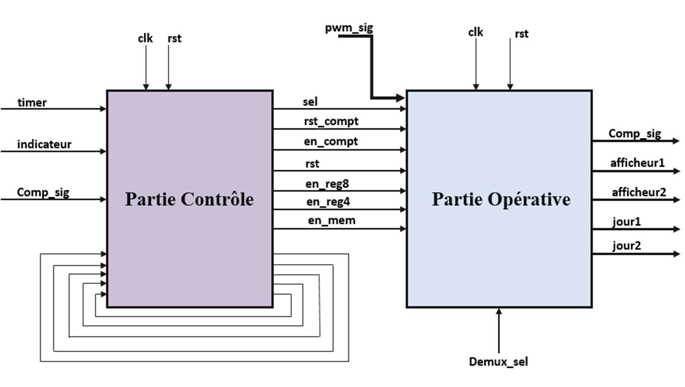
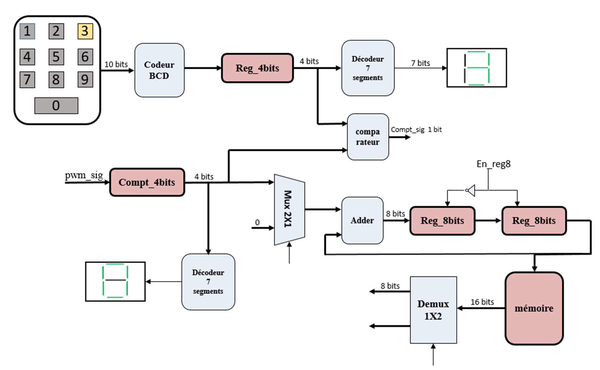
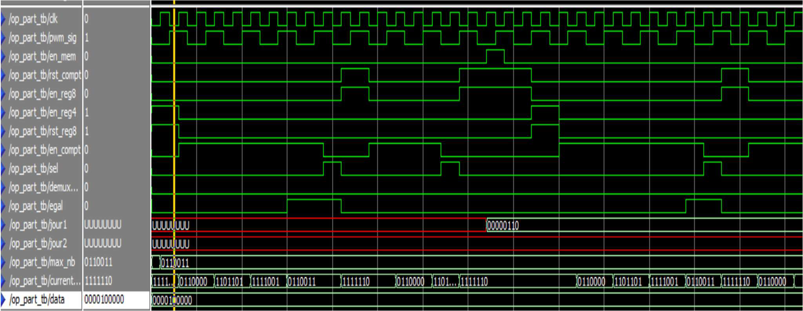
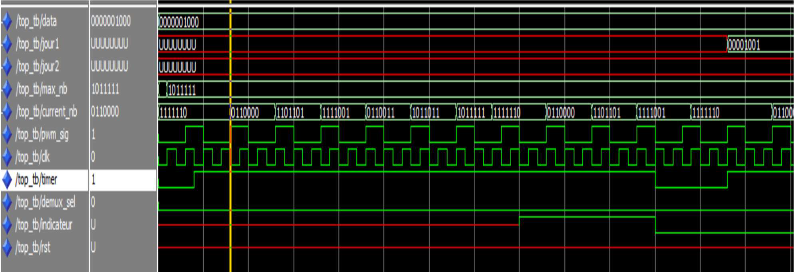

# SysCov
1. [Project description](#project-description)
2. [Syscov architecture](#sysCov-architecture)

3. [Tools](#tools)
4. [Simulation](#simulation)
5. [References](#references)
## Project description

The suggested circuit is a digital system designed for people counting, incorporating display elements such as a seven-segment display, and a sensor to detect the presence of individuals. This digital circuit undergoes a digital transformation process, constructed using conventional digital electronic components. It is encoded using a hardware description language, simulated, and compiled through computer-aided design (CAD) software. Importantly, the circuit is structured to be adaptable and can be implemented on a reprogrammable circuit.

**Purpose of the Circuit:**
This digital circuit serves the purpose of counting the number of individuals entering a confined space, such as a store, bank, or restaurant. It displays both the current number of people inside and the maximum allowed occupancy at the same time. This circuit modestly addresses a challenge posed by the COVID-19 crisis, which mandates a restriction on the number of individuals within a shared space (e.g., a store or restaurant). It is designed for spaces with limited capacity, typically accommodating between 1 and 9 people.

**Circuit Operation:**
The circuit is activated when the timer signal (associated with the opening and closing times of the premises) is in its high state. At this point, the maximum number of individuals allowed to enter simultaneously is predetermined through a keypad. People are detected using a sensor, and their presence is digitized into a signal. With each detection, a counter is incremented, and its value is displayed on a seven-segment display, indicating the current number of individuals inside the premises to those outside. Additionally, the circuit features memory capabilities (for more information, refer to the README file).

## SysCov architecture

- **timer Signal:** The timer signal is the signal that operates the circuit. It specifically corresponds to the signal representing the opening and closing times of the premises. For example, if 8:00 AM and 2:00 PM are the opening and closing hours of a bank, at 8:00 AM, the button generating the timer signal must be in its high state, and at 2:00 PM, it should be deactivated.
- **Indicateur Signal:** The indicator signal resets the counter when it is in the high state. When in its high state, it allows the counting to continue each time the maximum number is reached. It should be set to the high state only if it is not the time for closing the premises (a way to secure the premises so that it can be disinfected at any time).
- **pwm_signal:** This signal is generated whenever there is a person inside the premises. It facilitates the incrementation of the counter.
- **comp_signal:** This signal results from comparing the fixed maximum value and the number of people present inside the premises.
- **Display1 (Afficheur1):** Displays the maximum number of people allowed inside the premises simultaneously. The corresponding display is the seven-segment display.
- **Display2 (Afficheur2):** Displays the number of people inside the premises. The corresponding display is the seven-segment display.
- **Demux_sel:** Displays the results of day1 and day2 corresponding to the number of visitors to the premises in the last two days.
- **Clk and Rst:** Represent the clock and reset signals for the registers and state machine, respectively.

Detailed Architecture

## Tools

- VHDL
- Modelsim
- Quartus

## Simulation

**RTLViewer**

**Test**

## References

- Modélisation des circuits numériques en VHDL : Pr.A.MANSOURI
- Digital Fundamentals : Thomas L. Floyd